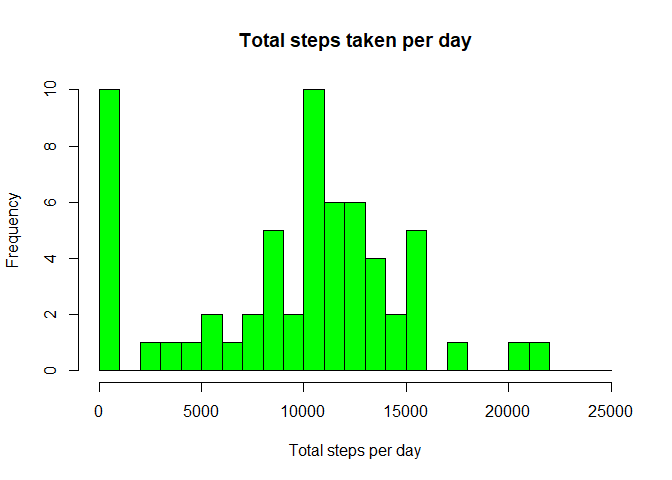
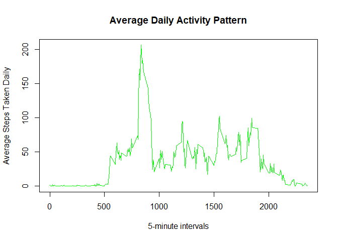
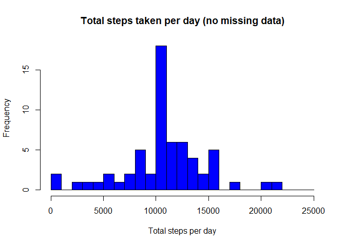
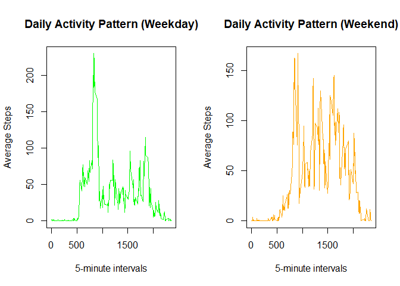

## Loading and preprocessing the data


```r
if (!file.exists('activity.csv')) {
  data.url <- 'https://d396qusza40orc.cloudfront.net/repdata%2Fdata%2Factivity.zip'
  data.zipfile <- './activity.monitoring.data.zip'
  download.file(data.url, data.zipfile)
  unzip(data.zipfile)
}

steps.data <- read.csv('activity.csv', header = TRUE)
steps.data$date <- as.Date(steps.data$date)
head(steps.data)
```

```
##   steps       date interval
## 1    NA 2012-10-01        0
## 2    NA 2012-10-01        5
## 3    NA 2012-10-01       10
## 4    NA 2012-10-01       15
## 5    NA 2012-10-01       20
## 6    NA 2012-10-01       25
```
## What is mean total number of steps taken per day?

```r
library(dplyr)
```

```
## 
## Attaching package: 'dplyr'
```

```
## The following objects are masked from 'package:stats':
## 
##     filter, lag
```

```
## The following objects are masked from 'package:base':
## 
##     intersect, setdiff, setequal, union
```

```r
steps.daily.total <- steps.data %>% 
    group_by(date) %>% 
    summarise(steps_total = sum(steps, na.rm = TRUE))

hist(steps.daily.total$steps_total, 
     main='Total steps taken per day',
     xlab = 'Total steps per day',
     breaks = seq(0, 25000, by = 1000),
     col = 'green')
```

<!-- -->

The mean of total number of steps taken per day

```r
mean(steps.daily.total$steps_total)
```

```
## [1] 9354.23
```

The median of totla number of steps taken per day

```r
median(steps.daily.total$steps_total)
```

```
## [1] 10395
```

## What is the average daily activity pattern?
1. Make a time series plot (i.e. type="l") of the 5-minute interval (x-axis) and the average number of steps taken, averaged across all days (y-axis)


```r
## calculate average number of steps on each 5-minute interval
steps.interval.average <- steps.data %>% 
    group_by(interval) %>% 
    summarise(steps_mean = mean(steps, na.rm = TRUE))
  
## plot a line chat 
plot(x = steps.interval.average$interval,
     y = steps.interval.average$steps_mean,
     main = 'Average Daily Activity Pattern',
     xlab = '5-minute intervals',
     ylab = 'Average Steps Taken Daily',
     col = 'green',
     type = 'l')
```

<!-- -->

2. Report which 5-minute interval, on average across all the days in the dataset, contains the maximum number of steps

```r
max.steps <- steps.interval.average$interval[which.max(steps.interval.average$steps_mean)]
max.steps
```

```
## [1] 835
```


## Imputing missing values

1. Calculate and report the total number of missing values in the dataset.

```r
sum(is.na(steps.data$steps))
```

```
## [1] 2304
```

2. Devise a strategy for filling in all of the missing values in the dataset.
- Filling the missing values with the mean of that day.

```r
steps.nas <- is.na(steps.data$steps)

interval_mean <- tapply(steps.data$steps, 
                       steps.data$interval, 
                       mean, na.rm=TRUE, 
                       simplify = TRUE)
```


3. Create a new dataset that is equal to the original dataset but with the missing data filled in.

```r
steps.data2 <- steps.data

steps.data2$steps[steps.nas] <- 
  interval_mean[as.character(steps.data2$interval[steps.nas])]

head(steps.data2)
```

```
##       steps       date interval
## 1 1.7169811 2012-10-01        0
## 2 0.3396226 2012-10-01        5
## 3 0.1320755 2012-10-01       10
## 4 0.1509434 2012-10-01       15
## 5 0.0754717 2012-10-01       20
## 6 2.0943396 2012-10-01       25
```


```r
# check for any missing values
sum(is.na(steps.data2))
```

```
## [1] 0
```

4. Make a histogram of the total number of steps taken each day and Calculate and report the mean and median total number of steps taken per day.

```r
library(dplyr)
steps.daily.total2 <- steps.data2 %>% 
    group_by(date) %>% 
    summarise(steps_total = sum(steps, na.rm = TRUE))

hist(steps.daily.total2$steps_total, 
     main='Total steps taken per day (no missing data)',
     xlab = 'Total steps per day',
     breaks = seq(0, 25000, by = 1000),
     col = 'blue')
```

<!-- -->

The impact of imputing missing data on the estimates of the total daily number of steps

```r
# summary of number of steps taken per day with missing data

summary(steps.daily.total)
```

```
##       date             steps_total   
##  Min.   :2012-10-01   Min.   :    0  
##  1st Qu.:2012-10-16   1st Qu.: 6778  
##  Median :2012-10-31   Median :10395  
##  Mean   :2012-10-31   Mean   : 9354  
##  3rd Qu.:2012-11-15   3rd Qu.:12811  
##  Max.   :2012-11-30   Max.   :21194
```


```r
# summary of number of steps taken per day without missing data

summary(steps.daily.total2)
```

```
##       date             steps_total   
##  Min.   :2012-10-01   Min.   :   41  
##  1st Qu.:2012-10-16   1st Qu.: 9819  
##  Median :2012-10-31   Median :10766  
##  Mean   :2012-10-31   Mean   :10766  
##  3rd Qu.:2012-11-15   3rd Qu.:12811  
##  Max.   :2012-11-30   Max.   :21194
```

## Are there differences in activity patterns between weekdays and weekends?
For this part the weekdays() function may be of some help here. Use the dataset with the filled-in missing values for this part.

```r
# add new variable(day.type): either weekday or weekend

steps.data2 <- steps.data2 %>%
  mutate(day.type = 
           ifelse(weekdays(date)=='Saturday' | weekdays(date)=='Sunday',
                  'Weekend', 
                  'Weekday'))

steps.data2$day.type <- ifelse(weekdays(steps.data2$date)=='Saturday' | weekdays(steps.data2$date)=='Sunday',
                  'Weekend', 
                  'Weekday')

head(steps.data2)
```

```
##       steps       date interval day.type
## 1 1.7169811 2012-10-01        0  Weekday
## 2 0.3396226 2012-10-01        5  Weekday
## 3 0.1320755 2012-10-01       10  Weekday
## 4 0.1509434 2012-10-01       15  Weekday
## 5 0.0754717 2012-10-01       20  Weekday
## 6 2.0943396 2012-10-01       25  Weekday
```


```r
# calculate average of steps taken per interval for all weekdays
steps.interval.average.weekday <- steps.data2 %>%
  filter (day.type == 'Weekday') %>%
  group_by(interval) %>%
  summarise(steps = mean(steps, na.rm = TRUE))
```


```r
# calculate average of steps taken per interval for all weekends
steps.interval.average.weekend <- steps.data2 %>%
  filter (day.type == 'Weekend') %>%
  group_by(interval) %>%
  summarise(steps = mean(steps, na.rm = TRUE))
```


```r
# plot 2 activity line chats, one for weekday, and one for weekend

par(mfrow = c(1,2))

# plot weekday activity
plot(x = steps.interval.average.weekday$interval,
     y = steps.interval.average.weekday$steps,
     main = 'Daily Activity Pattern (Weekday)',
     xlab = '5-minute intervals',
     ylab = 'Average Steps',
     col = 'green',
     type = 'l')

# plot weekend activity
plot(x = steps.interval.average.weekend$interval,
     y = steps.interval.average.weekend$steps,
     main = 'Daily Activity Pattern (Weekend)',
     xlab = '5-minute intervals',
     ylab = 'Average Steps',
     col = 'orange',
     type = 'l')
```

<!-- -->
